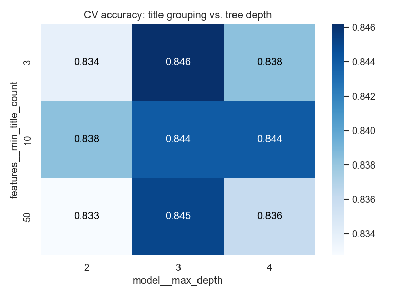

# Titanic Survival Analysis

Exploratory data analysis and a machine-learning model that predicts which passengers survived the Titanic disaster, using the [Kaggle Titanic dataset](https://www.kaggle.com/competitions/titanic/data).


## Notebooks

The project is split into four short notebooks. Each one runs on its own, from top to bottom.

| Notebook | What it covers |
|---|---|
| [01_exploration](notebooks/01_exploration.ipynb) | Loading, cleaning and exploring the data with charts |
| [02_modelling](notebooks/02_modelling.ipynb) | Feature engineering, model comparison, hyper-parameter tuning, first Kaggle submission |
| [03_improvements](notebooks/03_improvements.ipynb) | Group survival, deck and ticket features, voting ensemble, second submission |
| [04_pipelines](notebooks/04_pipelines.ipynb) | Rebuilding everything as a scikit-learn `Pipeline` with a custom transformer, leak-free cross-validation and pipeline tuning |

## Key findings

- **Sex** was the strongest predictor: 74% of women survived versus 19% of men.
- **Ticket class** mattered: 63% of 1st-class passengers survived, compared with 24% in 3rd class.
- **Children** and passengers travelling in **small families** (2–4 people) had better chances.
- A **Random Forest** model reaches ~82% cross-validated accuracy, beating a simple "all women survive" baseline (78%).
- Adding **group survival** features and a model ensemble raised the Kaggle public score from **0.775 to 0.792**.


## Model tuning and Kaggle submission

Random Forest, scikit-learn Gradient Boosting and XGBoost were tuned with grid and randomized search and compared with the same 5-fold stratified cross-validation:

| Model | CV accuracy |
|---|---|
| Gradient Boosting (tuned) | 0.837 |
| Random Forest (tuned) | 0.836 |
| XGBoost (tuned) | 0.834 |
| Logistic Regression | 0.831 |
| Random Forest (default) | 0.824 |

All models land within 1–2 percentage points of each other, so the engineered features (title, sex, class, family size) matter more than the algorithm. The best model was retrained on all 891 passengers to predict the 418 test passengers, and the predictions were saved to [`submissions/submission.csv`](submissions/submission.csv) for the [Kaggle competition](https://www.kaggle.com/competitions/titanic).

**Kaggle public score:** 0.77511 (Gradient Boosting, tuned)


## Group features and ensemble

New features were added from `Cabin` (deck letter), `Ticket` (group size, fare per person) and `Name` (family groups). The strongest one is **group survival**: the survival rate of the *other* members of a passenger's family or ticket group. Families and travel groups tended to survive or die together.


| Feature set (tuned Gradient Boosting) | CV accuracy |
|---|---|
| Original features | 0.845 |
| + deck & ticket | 0.848 |
| + deck, ticket & group survival | **0.855** |

A soft-voting ensemble of Logistic Regression, Random Forest, Gradient Boosting and XGBoost scored 0.852, about the same as the best single model.

| Kaggle submission | Model | Public score |
|---|---|---|
| v1 | Gradient Boosting (tuned), original features | 0.77511 |
| v2 | Voting ensemble, + group features | **0.79186** |
| v3 | Pipeline: Gradient Boosting, original features + deck | 0.76315 |

## Pipelines

The last notebook rebuilds the cleaning and the model as a single scikit-learn `Pipeline`:

```
raw CSV → TitanicFeatures (custom transformer) → ColumnTransformer (impute + one-hot) → Gradient Boosting
```

- Every cleaning step is refitted inside each cross-validation fold, so the score is free of data leakage by construction (0.843, compared with 0.841 for the manual approach: on this dataset the leakage turned out to be too small to measure).
- Cleaning choices and model settings are tuned together with `GridSearchCV`.
- New passengers and `test.csv` are predicted directly from raw columns with one call to `predict`.

The pipeline submission (v3) scored 0.763 on Kaggle, about the same as v1: the pipeline makes the process safer and reusable, while the score gain came from better features (v2).



## Project structure

```
├── data/                  # Kaggle CSVs (not committed – see below)
├── images/                # Charts saved by the notebooks
├── notebooks/
│   ├── 01_exploration.ipynb
│   ├── 02_modelling.ipynb
│   ├── 03_improvements.ipynb
│   └── 04_pipelines.ipynb
├── submissions/           # Kaggle prediction files (v1, v2, v3)
├── requirements.txt
└── README.md
```

## How to run

1. Download `train.csv` and `test.csv` from [Kaggle](https://www.kaggle.com/competitions/titanic/data) into the `data/` folder.
2. Install the dependencies:
   ```bash
   pip install -r requirements.txt
   ```
3. Open the notebooks in `notebooks/` in VS Code or Jupyter and run them in order (01 → 04).

## Tools

Python · pandas · NumPy · Matplotlib · seaborn · scikit-learn · XGBoost · Jupyter
