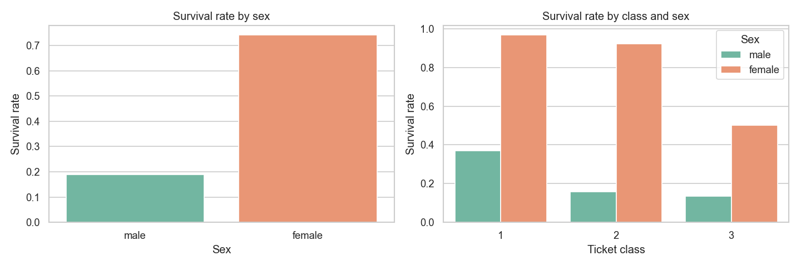
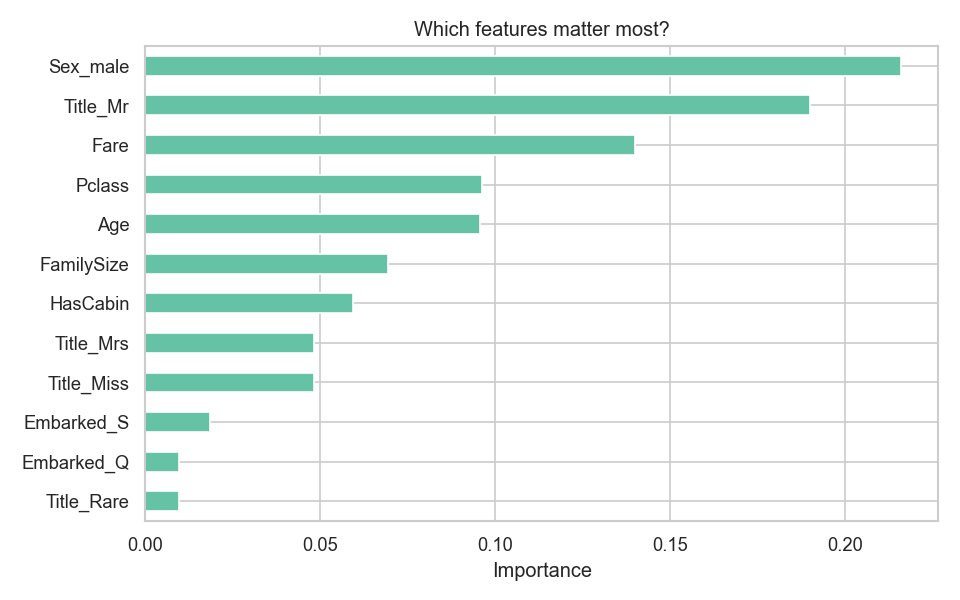
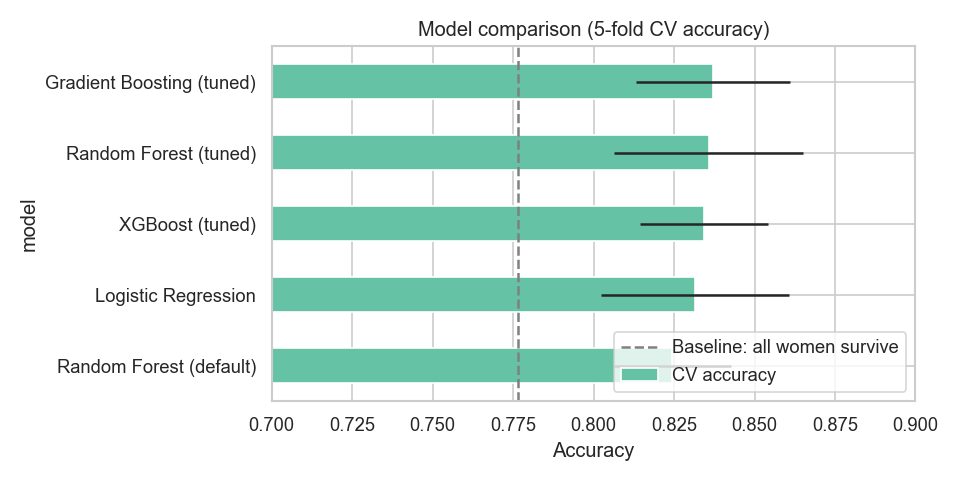
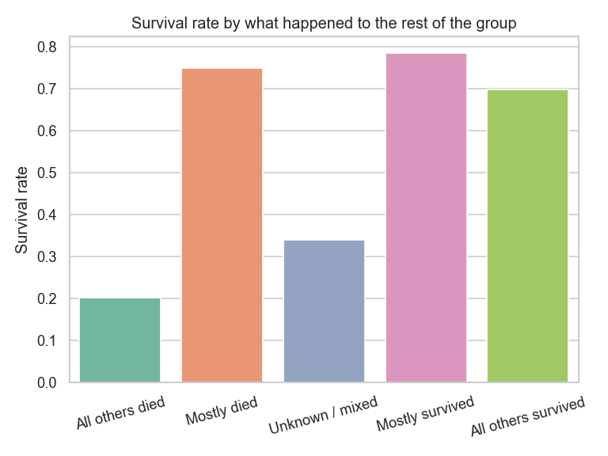

# Titanic Survival Analysis

Exploratory data analysis and a machine-learning model that predicts which passengers survived the Titanic disaster, using the [Kaggle Titanic dataset](https://www.kaggle.com/competitions/titanic/data).



## Key findings

- **Sex** was the strongest predictor: 74% of women survived versus 19% of men.
- **Ticket class** mattered: 63% of 1st-class passengers survived, compared with 24% in 3rd class.
- **Children** and passengers travelling in **small families** (2–4 people) had better chances.
- A **Random Forest** model reaches ~82% cross-validated accuracy, beating a simple "all women survive" baseline (78%).
- Adding **group survival** features and a model ensemble raised the Kaggle public score from **0.775 to 0.792**.



## Model tuning and Kaggle submission

Random Forest, scikit-learn Gradient Boosting and XGBoost were tuned with grid and randomized search and compared with the same 5-fold stratified cross-validation:

| Model | CV accuracy |
|---|---|
| Gradient Boosting (tuned) | 0.837 |
| Random Forest (tuned) | 0.836 |
| XGBoost (tuned) | 0.834 |
| Logistic Regression | 0.831 |
| Random Forest (default) | 0.824 |

All models land within 1–2 percentage points of each other, so the engineered features (title, sex, class, family size) matter more than the algorithm. The best model was retrained on all 891 passengers to predict the 418 test passengers, and the predictions were saved to [`submissions/submission.csv`](submissions/submission.csv) for the [Kaggle competition](https://www.kaggle.com/competitions/titanic).

**Kaggle public score:** 0.77511 (Gradient Boosting, tuned)



## Group features and ensemble

New features were added from `Cabin` (deck letter), `Ticket` (group size, fare per person) and `Name` (family groups). The strongest one is **group survival**: the survival rate of the *other* members of a passenger's family or ticket group. Families and travel groups tended to survive or die together.



| Feature set (tuned Gradient Boosting) | CV accuracy |
|---|---|
| Original features | 0.845 |
| + deck & ticket | 0.848 |
| + deck, ticket & group survival | **0.855** |

A soft-voting ensemble of Logistic Regression, Random Forest, Gradient Boosting and XGBoost scored 0.852, about the same as the best single model.

| Kaggle submission | Model | Public score |
|---|---|---|
| v1 | Gradient Boosting (tuned), original features | 0.77511 |
| v2 | Voting ensemble, + group features | **0.79186** |

## Would you have survived?

[`survival-calculator/index.html`](survival-calculator/index.html) is an interactive page: pick a sex, ticket class, age and travelling party size, and a gradient boosting model trained on those four features (82.8% cross-validated accuracy) estimates your chance of survival. It also plots your odds across every age and lists the real passengers most similar to you.

The page is a single static file; open it in a browser or host it on GitHub Pages. To retrain the model and refresh the data embedded in the page:

```bash
python survival-calculator/build_model.py
```

## Project structure

```
├── data/                  # Kaggle CSVs (not committed – see below)
├── images/                # Charts saved by the notebook
├── notebooks/
│   └── titanic_analysis.ipynb
├── survival-calculator/
│   ├── build_model.py                     # trains the model, embeds it in the page
│   └── index.html                         # "Would you have survived?" page
├── submissions/
│   ├── submission.csv                     # v1 Kaggle predictions
│   └── submission_v2_groups_ensemble.csv  # v2 Kaggle predictions
├── requirements.txt
└── README.md
```

## How to run

1. Download `train.csv` and `test.csv` from [Kaggle](https://www.kaggle.com/competitions/titanic/data) into the `data/` folder.
2. Install the dependencies:
   ```bash
   pip install -r requirements.txt
   ```
3. Open `notebooks/titanic_analysis.ipynb` in VS Code or Jupyter and run all cells.

## Tools

Python · pandas · NumPy · Matplotlib · seaborn · scikit-learn · XGBoost · Jupyter
